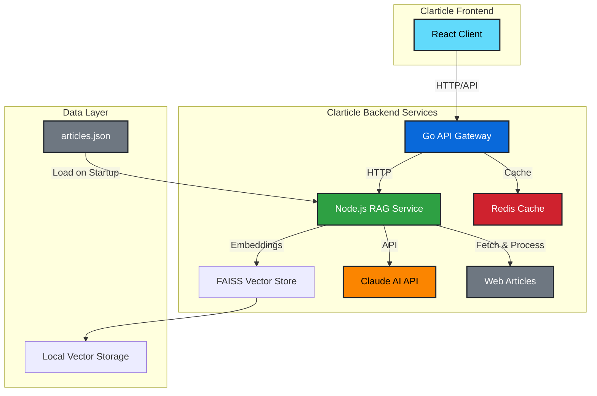

# Clarticle - AI-Powered RAG Chat System

Clarticle is a RAG (Retrieval-Augmented Generation) chat system that enables intelligent conversations about your article collection using Claude AI.

## 🏗️ Architecture Overview

Clarticle uses a hybrid microservices architecture combining Go and Node.js for optimal performance:



## 📁 Project Structure

```
Article-Chat/
├── client/                      # React frontend application
│   ├── src/
│   │   ├── components/          # React components
│   │   │   ├── ui/              # shadcn/ui components
│   │   │   ├── ChatInterface.tsx
│   │   │   ├── ArticleManager.tsx
│   │   │   ├── Footer.tsx
│   │   │   ├── theme-provider.tsx
│   │   │   └── theme-toggle.tsx
│   │   ├── lib/                 # Utilities and API client
│   │   │   ├── api.ts
│   │   │   └── utils.ts
│   │   ├── App.tsx              # Main app component
│   │   ├── main.tsx             # Entry point
│   │   └── index.css            # Global styles
│   ├── package.json
│   ├── vite.config.ts           # Vite configuration
│   ├── tailwind.config.js       # Tailwind CSS config
│   └── README.md                # Frontend documentation
│
├── server/                      # Go backend (API Gateway)
│   ├── cmd/
│   │   └── api/
│   │       └── main.go          # Entry point
│   ├── internal/                # Private packages
│   │   ├── config/              # Configuration management
│   │   ├── handlers/            # HTTP handlers
│   │   ├── middleware/          # HTTP middleware
│   │   ├── models/              # Data models
│   │   ├── services/            # Business logic
│   │   │   ├── rag_client.go    # RAG service client
│   │   │   └── cache.go         # Redis cache service
│   │   ├── validation/          # Input validation
│   │   ├── errors/              # Error handling
│   │   └── workers/             # Worker pools
│   ├── go.mod
│   ├── go.sum
│   └── README.md                # Backend documentation
│
├── rag-service/                 # Node.js RAG service
│   ├── src/
│   │   ├── services/            # Core services
│   │   │   ├── claude.service.ts
│   │   │   ├── embeddings.service.ts
│   │   │   ├── faiss-vectorstore.service.ts
│   │   │   └── langchain.service.ts
│   │   ├── routes/              # API routes
│   │   │   ├── chat.routes.ts
│   │   │   └── articles.routes.ts
│   │   ├── middleware/          # Express middleware
│   │   ├── utils/               # Utilities
│   │   │   ├── errors.ts
│   │   │   └── startup-loader.ts
│   │   └── index.ts             # Entry point
│   ├── package.json
│   ├── tsconfig.json
│   ├── nodemon.json             # Nodemon config
│   └── README.md                # RAG service documentation
│
├── data/                        # Data directory
│   ├── articles.json            # Initial articles list
│   └── faiss_store/             # Vector store (generated)
│
├── docker-compose.yml           # Docker orchestration
├── client.Dockerfile            # Frontend container
├── server.Dockerfile            # Backend container
├── rag-service.Dockerfile       # RAG service container
├── nginx.conf                   # Nginx configuration for frontend
├── README.md                    # This file
├── INSTALL.md                   # Installation guide
```

## 🛠️ Technology Stack

### Frontend

- **React 19** with TypeScript
- **Vite** for build tooling
- **shadcn/ui** component library
- **Tailwind CSS v4** for styling

### Backend (API Gateway)

- **Go 1.22+** with Fiber framework
- **Worker pools** for concurrent request handling
- **Redis** for response caching
- **Structured logging** with slog

### RAG Service

- **Node.js 20+** with Express
- **LangChain.js** for RAG pipeline
- **Claude AI** (Anthropic) for language model
- **FAISS** for local vector storage
- **HuggingFace Transformers** for embeddings

### Infrastructure

- **Docker** & **Docker Compose** for containerization
- **Multi-stage builds** for optimized images

## ✨ Key Features

- **Intelligent Chat**: Ask questions about your articles and get contextual answers
- **Article Management**: Add articles via URL for processing
- **Local Embeddings**: Free embeddings using HuggingFace models
- **Response Caching**: Lightning-fast repeated queries with Redis
- **Professional UI**: Claude/ChatGPT-style interface with animations
- **Error Handling**: Comprehensive error handling with detailed error codes
- **Concurrent Processing**: Handle multiple users simultaneously

## 🚀 Quick Start

For detailed installation instructions, see [INSTALL.md](./INSTALL.md).

```bash
# Clone repository
git clone https://github.com/Danor93/Article-Chat.git
cd Article-Chat

# Setup environment
cp server/.env.example server/.env
cp rag-service/.env.example rag-service/.env
cp client/.env.example client/.env

# Add your Anthropic API key to rag-service/.env
# ANTHROPIC_API_KEY=sk-ant-api03-your-key-here

# Start services
docker-compose up --build

# Access application
open http://localhost:3000
```

## 📋 Requirements

- Docker Desktop
- Anthropic Claude API key
- 4GB+ RAM recommended
- Modern web browser

## 🎯 How It Works

1. **Article Processing**: Add articles via URL → Text extraction → Chunking → Embedding generation → Vector storage
2. **Chat Flow**: User question → Vector search → Relevant context retrieval → Claude AI generation → Response
3. **Caching**: Repeated questions are cached for instant responses

## 🔧 Configuration

Key environment variables:

- `ANTHROPIC_API_KEY`: Your Claude API key (required)
- `CLAUDE_MODEL`: Model selection (default: claude-3-7-sonnet-latest)
- `CHUNK_SIZE`: Text chunk size for embeddings (default: 1000)
- `RAG_SEARCH_RESULTS`: Number of context chunks to retrieve (default: 4)

## 📊 Performance

- **Response Time**: 5-8 seconds (first query), <100ms (cached)
- **Concurrent Users**: 10-50 supported
- **Article Processing**: 6-8 chunks per article
- **Cache Hit Rate**: ~40% in typical usage

## 🔮 Future Enhancements

*Potential features for extended development:*

- **User Authentication**: PostgreSQL-based authentication to protect backend services, manage users, conversation history, and sessions
- **Streaming Responses**: Real-time response streaming
- **Testing Suite**: Unit and integration tests
- **K8s Deployment**: Kubernetes manifests and CI/CD pipelines
